# Familjen State Machine Architecture

This document describes the state machines that power the Familjen family planning app.

## Overview

Familjen uses a **multi-layered state machine architecture** handling:
- Authentication & session management
- Page rendering with caching
- Offline-first data sync
- External integrations
- Navigation transitions

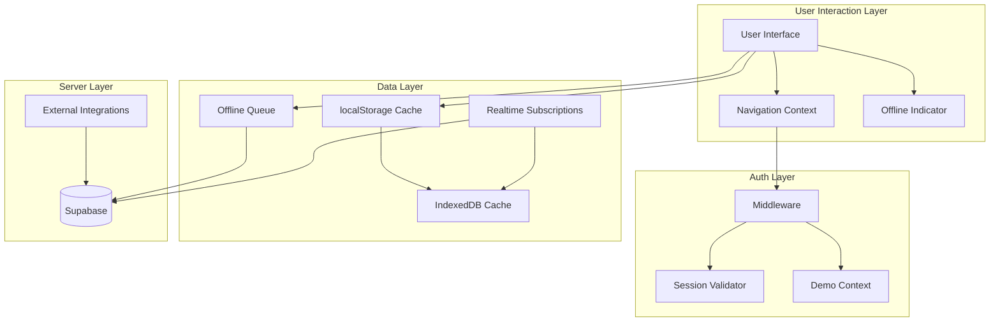

---

## 1. Authentication State Machine

The auth system uses a **3-layer validation strategy** for instant page loads.

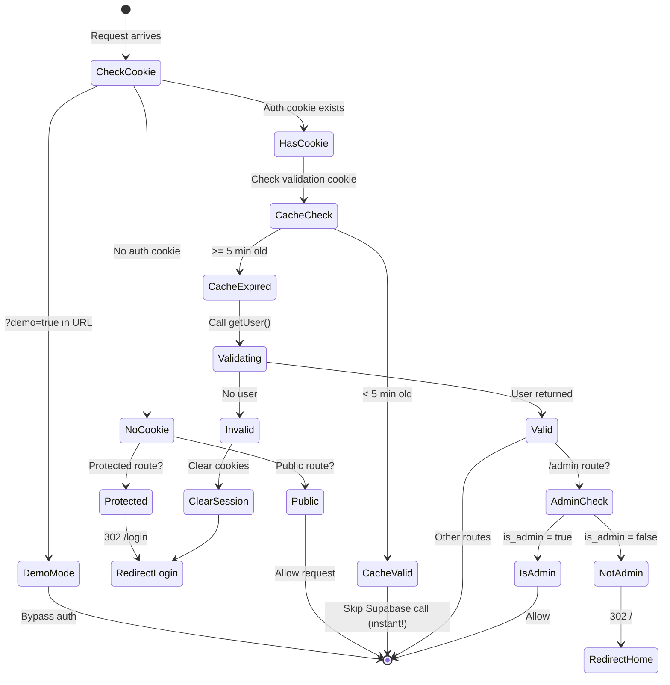

### Background Session Validator

Runs every 5 minutes to catch stale PWA sessions:

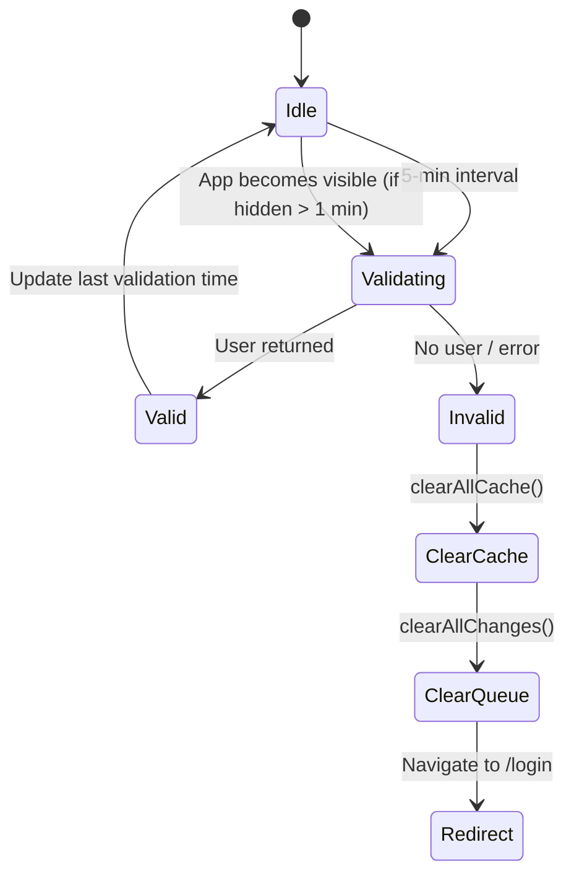

**Files:**
- `src/lib/supabase/middleware.ts`
- `src/hooks/useSessionValidator.ts`

---

## 2. Page Rendering State Machine

Uses **PPR (Partial Pre-Rendering)** with cache fallback for instant loads.

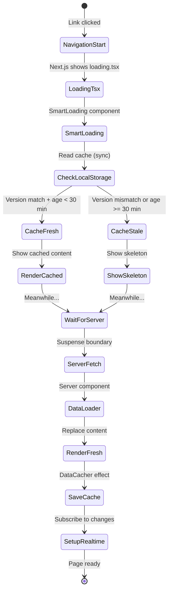

### Cache Layers

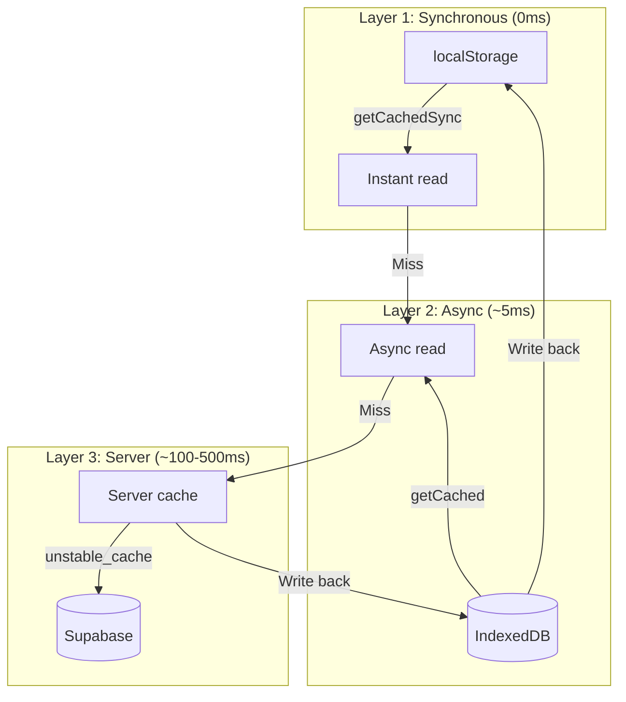

**Files:**
- `src/components/SmartLoading.tsx`
- `src/lib/cache.ts`
- `src/lib/cache-sync.ts`

---

## 3. Navigation State Machine

Delayed loading indicator prevents flash for fast navigations.

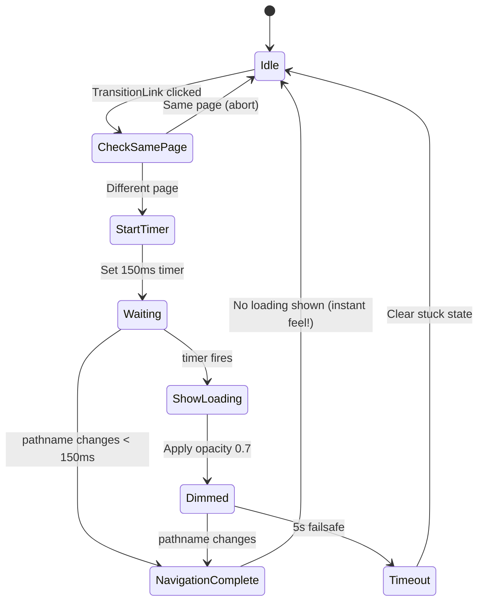

**Visual States:**

| State | UI Effect |
|-------|-----------|
| Idle | Normal |
| Waiting | No visual change |
| Dimmed | `opacity: 0.7`, `pointer-events: none` |

**File:** `src/lib/navigation/context.tsx`

---

## 4. Offline Sync State Machine

Queues changes when offline, syncs when online with conflict detection.

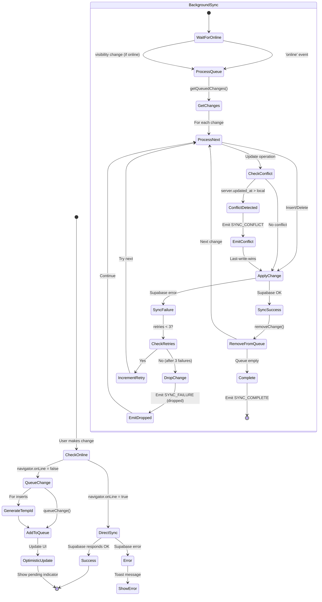

### Offline Indicator States

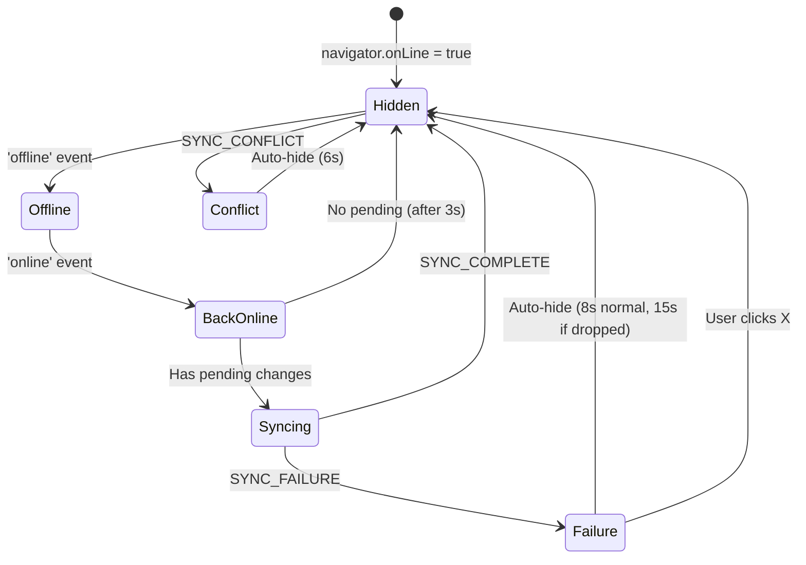

**Color Coding:**

| State | Color | Priority |
|-------|-------|----------|
| Failure | Coral red | 1 (highest) |
| Conflict | Honey yellow | 2 |
| Offline | Sky blue | 3 |
| Syncing | Honey yellow | 4 |
| Back Online | Sage green | 5 |

**Files:**
- `src/lib/offline-queue.ts`
- `src/hooks/useBackgroundSync.ts`
- `src/components/OfflineIndicator.tsx`

---

## 5. Integration Sync State Machine

Manages connections to external services (Spond, MyKid, Kidplan, iSkole).

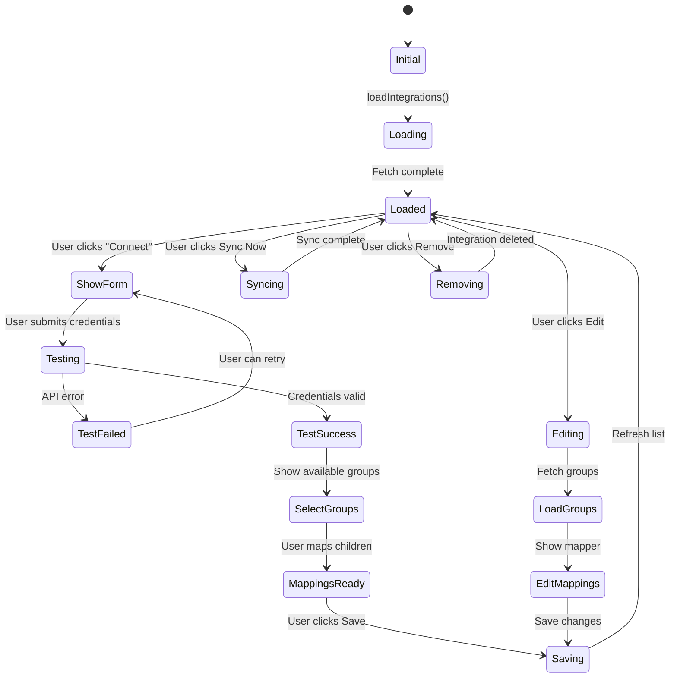

### Integration Data Flow

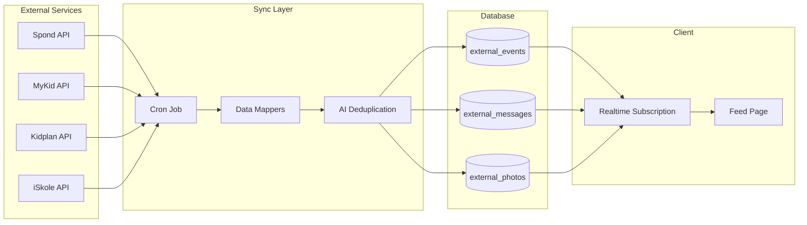

**Files:**
- `src/components/integrations/shared/useIntegrationState.ts`
- `src/lib/integrations/` (clients for each service)
- `src/app/api/cron/sync-integrations/route.ts`

---

## 6. Demo Mode State Machine

Provides full UI functionality without real API calls.

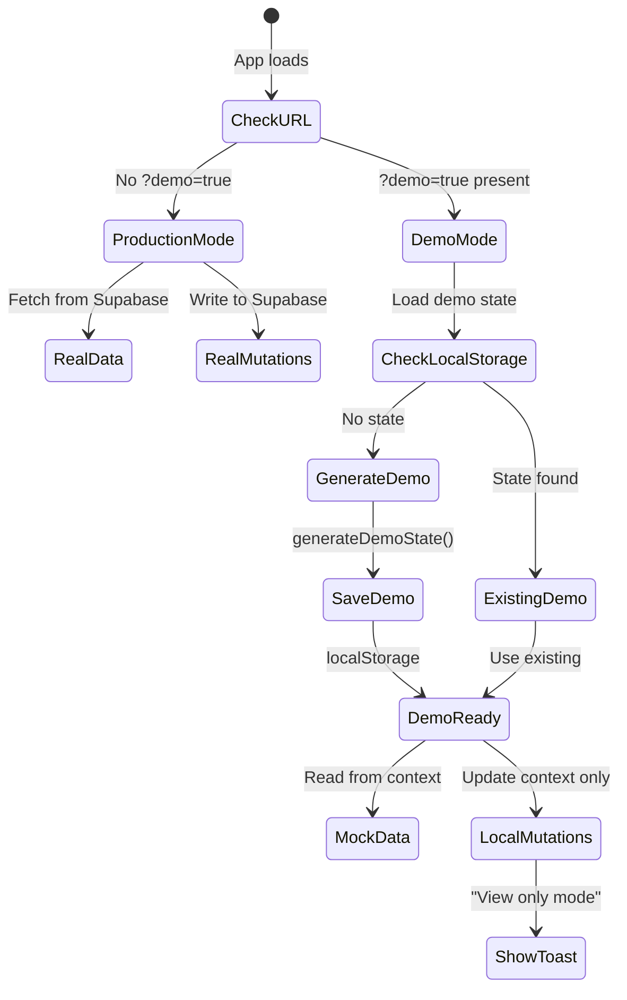

**Key Behavior:**
- Same components for demo and production
- Mutations show info toast instead of API calls
- State persists in localStorage during session
- E2E tests use demo mode

**File:** `src/lib/demo/context.tsx`

---

## 7. Realtime Update State Machine

Handles WebSocket updates from Supabase.

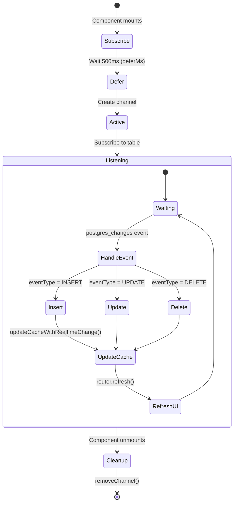

### Cache Update Flow

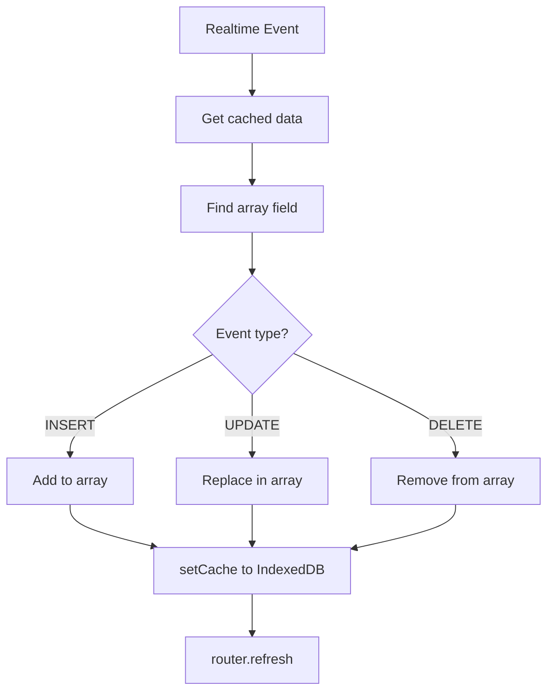

**File:** `src/lib/cache.ts` (updateCacheWithRealtimeChange)

---

## 8. Session & Cache Coordination

Shows how auth events affect cache state.

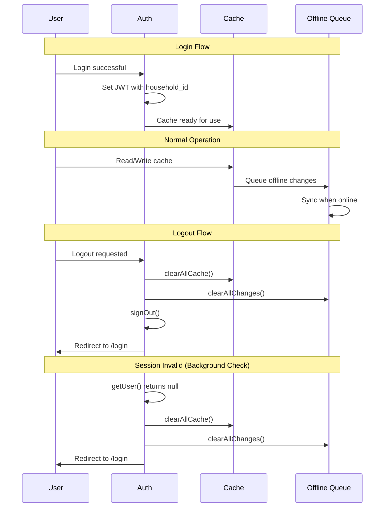

---

## 9. State Persistence Summary

| State Machine | Storage | Scope | TTL | Cleared On |
|---------------|---------|-------|-----|------------|
| Auth Session | HTTP cookie | Cross-tab | Session | Logout |
| Validation Cache | HTTP cookie | Cross-tab | 5 min | Expires |
| Page Cache (LS) | localStorage | Tab | 30 min | Logout, version change |
| Page Cache (IDB) | IndexedDB | Tab | 3 min | Logout, version change |
| Offline Queue | IndexedDB | Tab | Until sync | Logout, sync success |
| Demo State | localStorage | Tab | Session | Exit demo |
| Navigation | Memory | Tab | None | Component unmount |

---

## 10. Error Recovery Paths

### Sync Failure Recovery

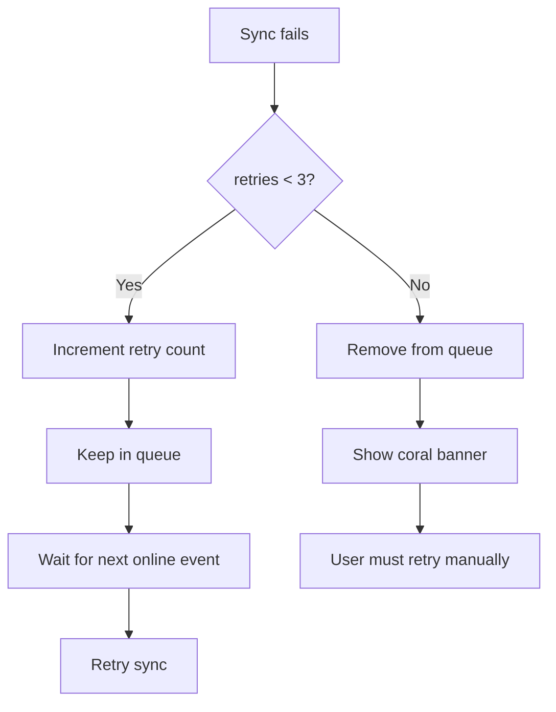

### Cache Error Recovery

```mermaid
flowchart TB
    ERROR[IndexedDB error] --> RECOVERABLE{Recoverable?}

    RECOVERABLE -->|Yes| RESET[resetConnection()]
    RESET --> RETRY[Retry once]
    RETRY --> SUCCESS[Continue]
    RETRY --> FAIL[Log warning]

    RECOVERABLE -->|No| FAIL
    FAIL --> SKELETON[Fall back to skeleton]
```

---

## 11. Performance Critical Paths

### Fastest Path: Cached Navigation

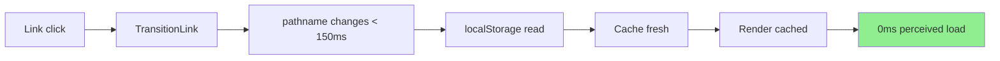

### Slowest Path: Cold Start

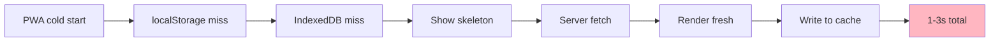

---

## 12. Component Dependencies

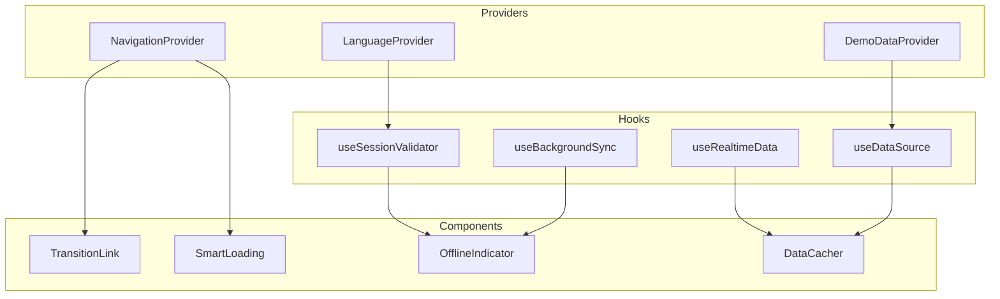

---

## Quick Reference

| Action | State Machine | Key State Change |
|--------|---------------|------------------|
| Click link | Navigation | Idle → Waiting → (Loading) → Idle |
| Edit offline | Offline Sync | Online → Queued → Syncing → Done |
| Login | Auth | Unauthenticated → Validating → Valid |
| Sync integration | Integration | Loaded → Syncing → Loaded |
| Realtime update | Cache | Fresh → Update → Fresh |
| App goes offline | Offline | Online → Offline |
| Session expires | Auth | Valid → Invalid → Redirect |
